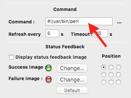
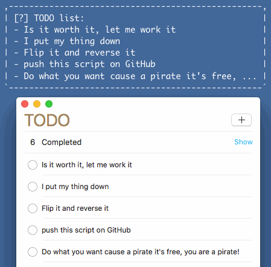

# TODOWidget
a TODO widget for GeekTool which interacts with Apple Reminder app.

## Install

First you need [reminders-cli](https://github.com/keith/reminders-cli) then download [GeekTool](https://www.tynsoe.org/v2/geektool/), I know it's an old and abandoned project but it still does its job.

Create a new **Shell** widget using GeekTool and copy the script in `bin/` directory, inside Command field as shown below:

then you decide the refresh, timeout, font and all those things.

## Demo

